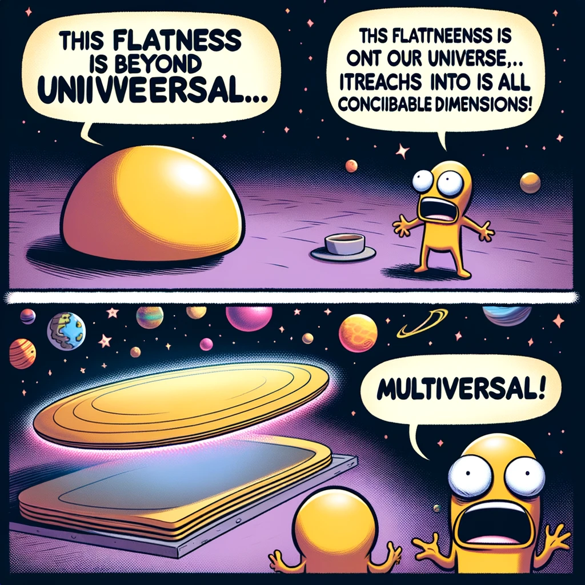

# Flatlana
An example of using flatbuffers on solana

### Prerequisites
* A computing device (if you are stuck here, um.. turnaround and go back to bed)
* Solana tools (find them yourself)
* FlatC (im not googling this for you)

### Why
I was bored with borsh and I love pain so I wanted to show how life can be hard with flatbuffers on solana. All jokes aside you get a zero copy deserialization and a very fast serialization. Along with that you get a cross platform schema definition which makes client generation fast. 

### Let it be known
I scraped this code froma  working project as an example, I offer no guarantees that this code is secure or even works. I will not be held responsible for any damages or losses that may occur from using this code. It "SHOULD" work, or at least it does in my other project. 